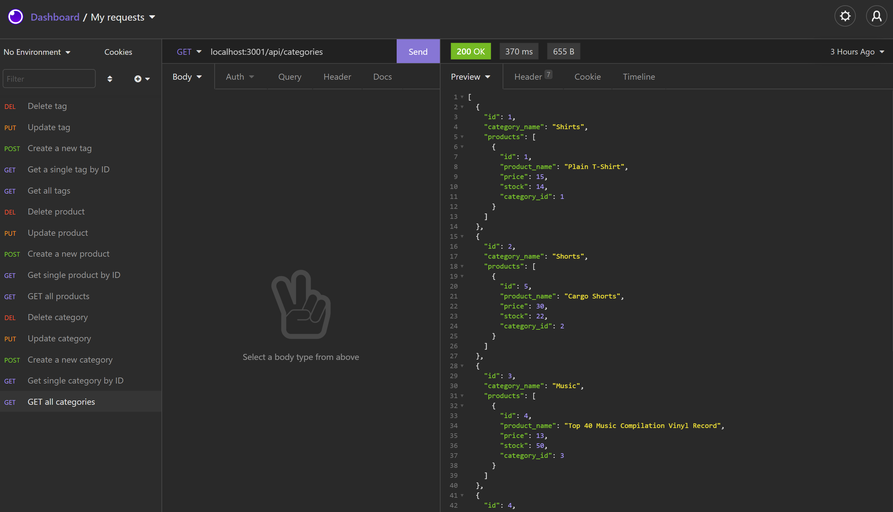
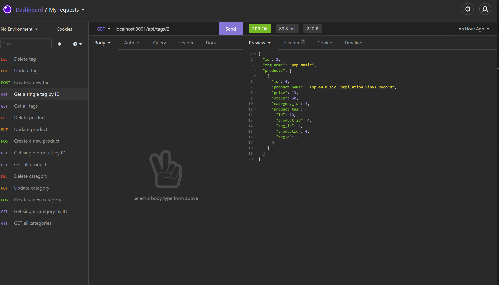

# 13 Object-Relational Mapping (ORM): E-Commerce Back End

## About this project

This project was focused on building the back end for an e-commerce site, using Sequelize to interact with a MySQL database. Express.js API routes was employed to achieve full functionality, following the CRUD method using GET, PUT, POST, DELETE routes. 

## Technologies used

1. Express.js
2. Sequelize
3. MySQL
4. MySQL2
5. DOTENV package
6. Insomnia

## Link to demo video

[Click here to view the demo](https://youtu.be/jtKUuJVerI4)

## Screen shots of Insomnia 






## User Story

```md
AS A manager at an internet retail company
I WANT a back end for my e-commerce website that uses the latest technologies
SO THAT my company can compete with other e-commerce companies
```

## Acceptance Criteria

```md
GIVEN a functional Express.js API
WHEN I add my database name, MySQL username, and MySQL password to an environment variable file
THEN I am able to connect to a database using Sequelize
WHEN I enter schema and seed commands
THEN a development database is created and is seeded with test data
WHEN I enter the command to invoke the application
THEN my server is started and the Sequelize models are synced to the MySQL database
WHEN I open API GET routes in Insomnia Core for categories, products, or tags
THEN the data for each of these routes is displayed in a formatted JSON
WHEN I test API POST, PUT, and DELETE routes in Insomnia Core
THEN I am able to successfully create, update, and delete data in my database
```

## How to install

1. Run npm install to install all relevant packages
2. Start the server with 'npm start' in the command line

## Licenses

MIT